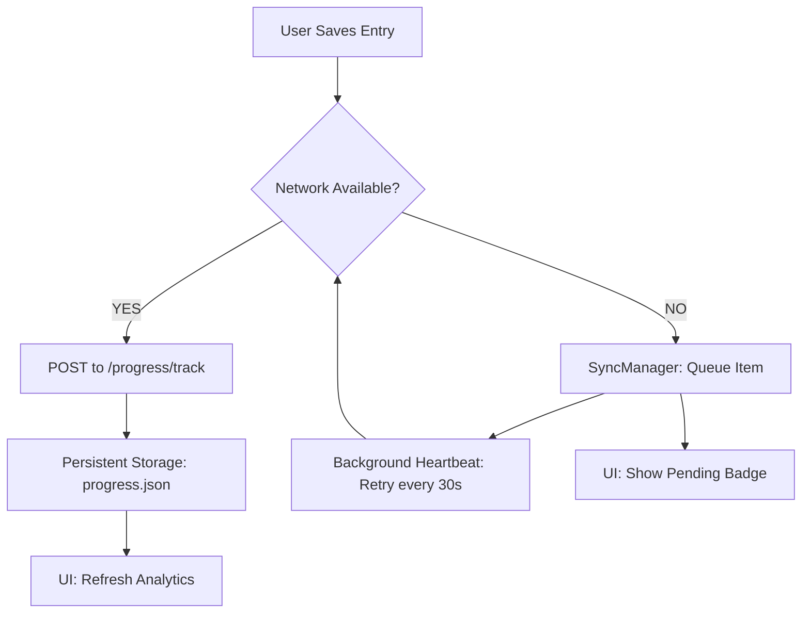

# Otra App Fitness 🚀
### Premium Local-First Fitness & Nutrition Ecosystem

Welcome to the foundation of **Otra App Fitness**, a state-of-the-art fitness tracking application built with a **Security-First** and **Offline-Reliable** architecture. This project serves as the bridge between on-premise stability and high-scale cloud infrastructure.

---

## 🛠 Tech Stack
- **Mobile**: Flutter (Dart) with BLoC Pattern & Glassmorphism UI.
- **Backend**: Serverless (TypeScript) running on Node.js 20.x.
- **Security**: AES-256 Encryption (`AesVault`) for sensitive health data.
- **Reliability**: Background Sync Manager for seamless offline entries.
- **Testing**: Jest (API) & Flutter Test (Mobile).

---

## 🔄 Core Workflow: Reliability Sync
The application implements a robust local-first strategy. Even without an internet connection, your progress is never lost.



---

## 📂 Project Structure
```text
├── api/                # Serverless TypeScript API
│   ├── src/
│   │   ├── auth/       # Registration & AES-256 Vault
│   │   ├── routines/   # Safety-Filtered Routine Engine
│   │   ├── nutrition/  # Allergy-Aware Nutrition Engine
│   │   ├── progress/   # Persistence & Analytics Logic
│   │   └── tests/      # 100% Healthy Test Suite
│   └── serverless.yml  # AWS Cloud Blueprint
└── mobile/             # Flutter Application
    ├── lib/
    │   ├── core/       # SyncManager & Config
    │   ├── shared/     # Glassmorphism Theme & AesVault
    │   └── features/   # Routines, Progress, & Nutrition
```

---

## 🚀 Getting Started

### 1. API (Backend)
```bash
cd api
npm install
npm run dev    # Start Serverless Offline
npm test       # Run Verification Suite
```

### 2. Mobile (Frontend)
```bash
cd mobile
flutter pub get
flutter run    # Launch Premium UI
```

---

## 🛡 Security & Safety
- **AES-256 Encryption**: All medical tags and injury data are encrypted locally before transmission.
- **Safety Filters**: Routine and Nutrition engines automatically exclude exercises or foods that conflict with your profile (Injuries/Allergies).

---

**Status**: Phase 6 Foundation Complete | **Cloud Readiness**: 100%
